# Code for start using Google Analytics data in R

## Contents

* Hello world example
* Basic exploratory data analysis
* Data visualizations
* Users segmentation

### Hello world example

Conect to Google Analytics from R and download basic data.

### Basic exploratory data analysis

Learn about dataset:
* Calculate basic statistics (min, max, mean, median, standard deviation)

* Plot histogram to check distribution

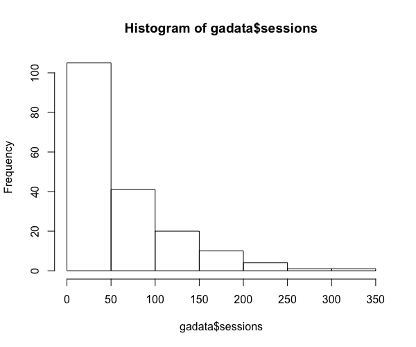

* Plot line chart to check values in times

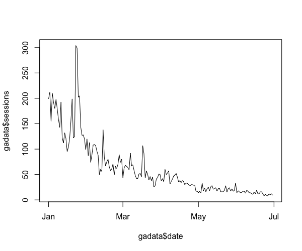

* Prepare subset with days with low and high traffic

### Data visualizations

* Basic line chart - sessions in time

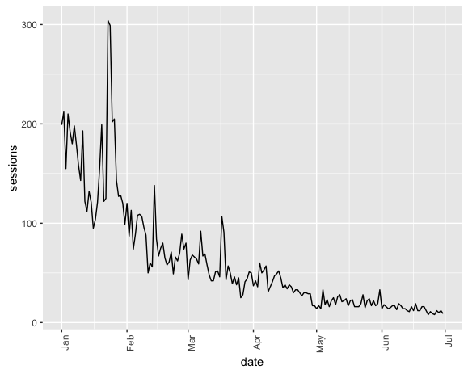

* Basic scatter plot - sessions in time

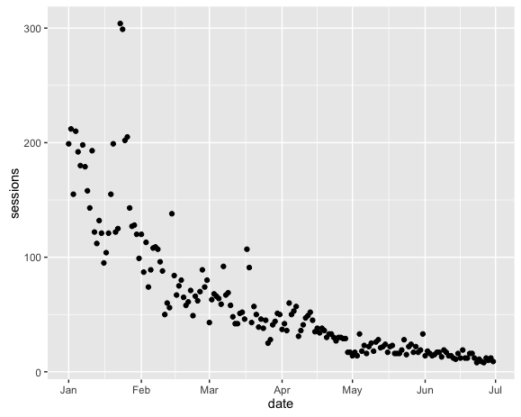

* Scatter plot with point size and color (bubble chart) - sessions in time

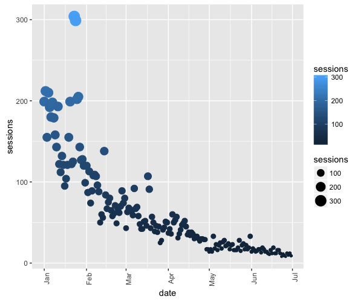

* Scatter plot with trend line - sessions in time

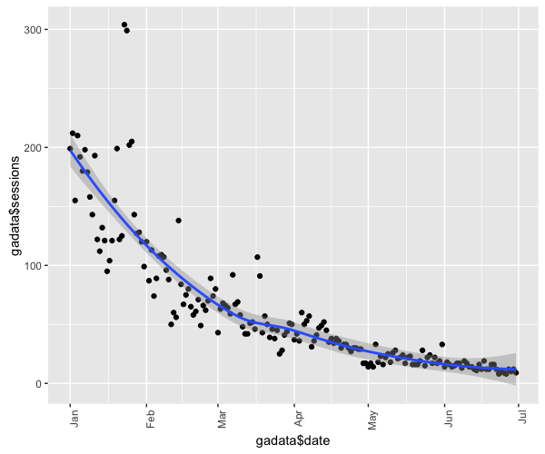

* Box plot - sessions distribution by dayOfWeek

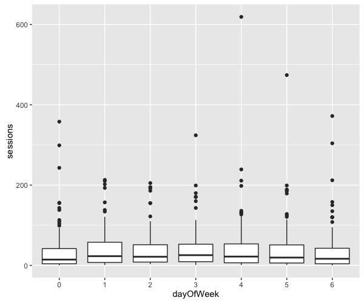

### Forecasting

Forecasting web traffic using Holt-Winters method.  Inspired by [Richard Fergie](https://github.com/richardfergie)

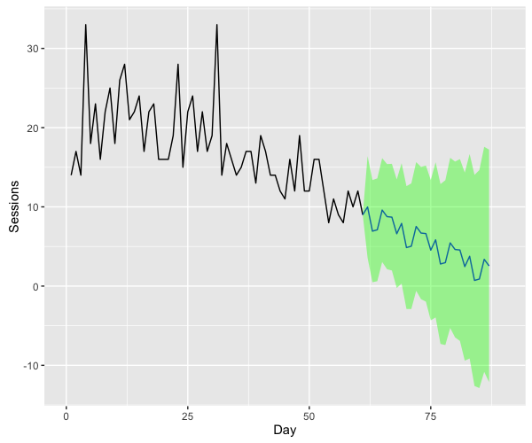

### Users segmentation

Clustering website users by interests using k-means method and visualization in 3D scatter plot using `plotly`.

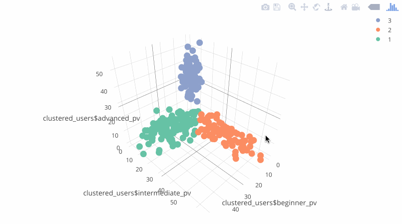

### Web traffic heatmap

Create heatmap of web traffic. Inspired by [Todd Moy](https://github.com/toddmoy)

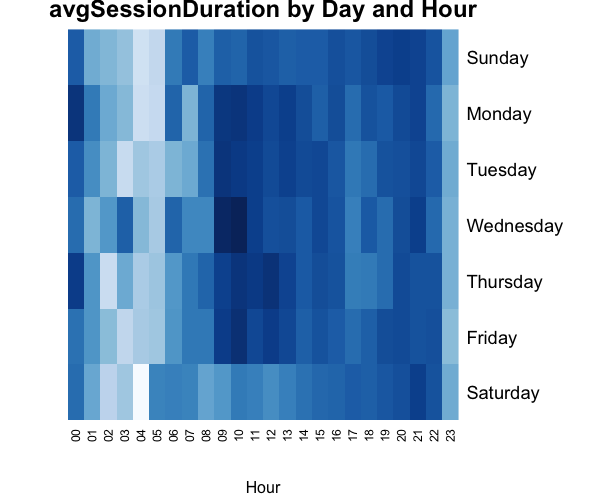

### Device comparsion

Compare behavior of different user segments (by deviceCategory).

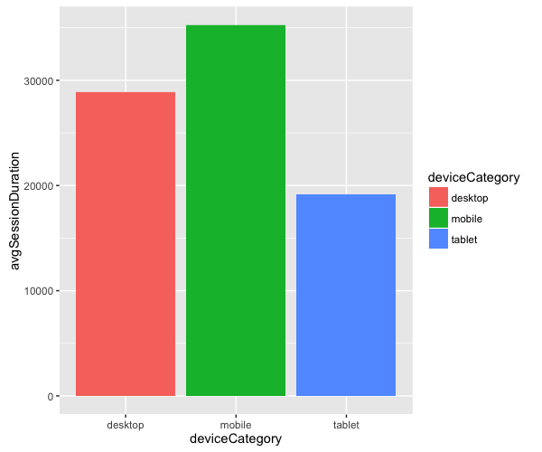

## Others resources

All cases using library `googleAnalyticsR` by  [Mark Edmonson](https://github.com/MarkEdmondson1234)
